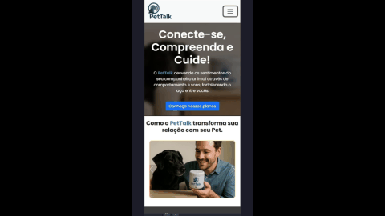

# 🐾 PetTalk – Página de Apresentação de Produto

Este projeto é uma página de apresentação do **PetTalk**, um dispositivo inteligente capaz de traduzir sentimentos de pets com base em sons e comportamentos.

Desenvolvido como parte de um desafio técnico, o foco foi criar uma landing page funcional, responsiva e atrativa utilizando **Bootstrap 5** com o conceito de **Mobile First**.

---

## 🎯 Tecnologias Utilizadas

- HTML5
- CSS3
- Bootstrap 5
- Font Awesome
- Mobile First Design

---

## 📱 Layout Responsivo

A interface foi construída com atenção à experiência em dispositivos móveis, adaptando o conteúdo de forma fluida e acessível para diferentes tamanhos de tela.

---

## 🎨 Paleta de Cores e Gradiente

As cores e o gradiente foram definidos com auxílio da ferramenta [mycolor.space](https://mycolor.space/gradient3?ori=to+right+top&hex=%23050585&hex2=%23527DCB&hex3=%235FFB73&submit=submit), garantindo harmonia visual e consistência com a identidade do produto.

---

## 📸 Demonstração



---

## 🌐 Acesse o Projeto

Você pode visualizar o projeto online em:  
🔗 [taisgb.github.io/pettalk](https://taisgb.github.io/pettalk)

---
# 📁 Estrutura de Pastas

```
/assets
  ├── carrossel/
  ├── clientes/
  ├── hero1.png
  ├── produto6.png
  ├── produto11.png
  ├── pet_talk_demo.gif
```

---

## 📌 Observações

- Este projeto não possui backend.
- O botão de CTA leva a um link externo fictício (`taisgb.com.br`).
